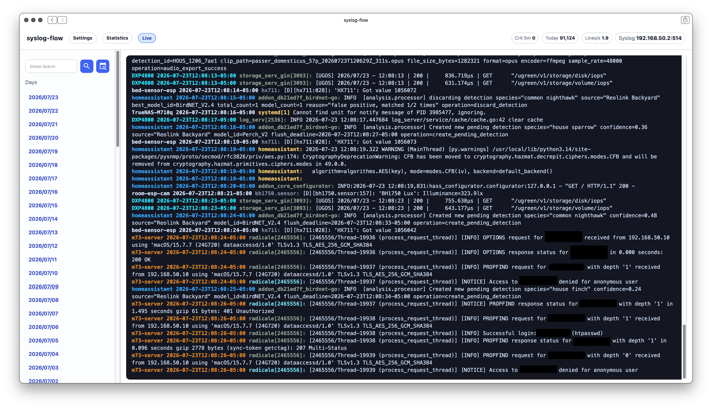
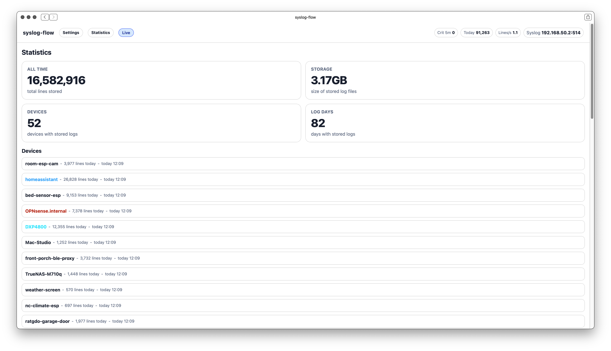

# syslog-flow

An awesome, lightweight plaintext syslog collection with a responsive and clean web UI.



I wanted an easy and light logging server that did not require a observability stack, so I created this ~250KB *(not including built container itself)* Docker container that is simple, self contained, with only 1 dependency.

`syslog-flow` runs two processes in one container:

- `rsyslogd` listens for syslog on UDP and TCP `514`
- `syslog-flow` serves the web UI and stats API on `2200`



----

## What It Does

- Ingests logs using rsyslog
- Stores ingested logs as plain text under `/logs` with date-based folders and one file per device
- Shows a live-updating log view in the browser
- Supports day views, per-file views, global search, and severity filters
- Shows simple statistics and live device activity
- Exposes a simple numeric stats API at `GET /api/stats`

Example log layout on-disk:

```text
logs/
  2026/
    05/
      01/
        router.log
        nas.log
        homeassistant.log
```

## Build and Install

Create a folder called `syslog-flow`, `cd` into it, and git clone this repository into it.

Then, simply build and run the container:

```sh
docker compose up --build -d
```

Default ports:

- `2200/tcp`: web UI and stats API
- `514/udp`: syslog ingest
- `514/tcp`: syslog ingest

Default UI URL:

```text
http://localhost:2200
```

Then, start by pointing devices at this host on syslog UDP/TCP port `514`.

----

## Notes

- Logs are stored as plain text only. There is no database.
- `entrypoint.sh` keeps `rsyslogd` and the web process running together and stops the container if either one exits.
- Basic mobile support is available! To keep it light, I did not implement features like collapsible sidebar, but I did test on iPhones of various sizes and added Jump to Top/Bottom buttons, among other things.
- PRs, issues, and discussions are welcome! However, please keep in mind that this exists to be extremely lightweight. If you need advanced features *(e.g authentication, reverse proxy support, multi-user support, Grafana)*, feel free to fork the repo and develop a custom version.
- Currently, there is no automatic log pruning. This could change in the future.
- Disclaimer: all Go code was written by GPT 5.5 & 5.4 Codex. However, I did use common sense and I tested everything, as I use this myself.


## Details, Config, and API

On a fresh install, `syslog-flow` creates missing config files with defaults before startup.

Generated files:

- `config/app.json`
- `config/device-colors.json`
- `config/interface-colors.json`
- `config/status-colors.json`

### app.json

Controls browser polling intervals:

```json
{
  "live_refresh_seconds": 2,
  "stats_refresh_seconds": 10,
  "overview_refresh_seconds": 10
}
```

### device-colors.json

Optional per-device heading colors in the UI:

```json
{
  "router": "#00B4FF",
  "switch": "#EB8C00"
}
```

### interface-colors.json

Interface theme colors for light and dark mode:

```json
{
  "light": {
    "accent": "#0078ff",
    "line": "rgba(0, 0, 0, 0.18)"
  },
  "dark": {
    "accent": "#0078ff",
    "line": "#2c3b36"
  }
}
```

This file defines the main interface palette used by the UI. Missing keys fall back to built-in defaults.

### status-colors.json

Optional severity colors for rendered log tags:

```json
{
  "emerg": "#FF4D4D",
  "alert": "#FF4D4D",
  "crit": "#FF4D4D",
  "err": "#FF6B6B",
  "warning": "#FFD166",
  "notice": "#7BDFF2",
  "info": "#9AA89F",
  "debug": "#8E9AAF"
}
```

## API

`GET /api/stats`

Example response:

```json
{
  "critical_5m": 0,
  "today_lines": 48060,
  "all_lines": 48060,
  "lines_per_second": 0,
  "log_bytes": 4823119,
  "log_days": 1,
  "devices": 10
}
```

Home Assistant `configuration.yaml` REST config:

```yaml
rest:
  - resource: http://<YOUR-SERVER-IP>:2200/api/stats
    scan_interval: 30
    sensor:
      - name: "Syslog Lines Per Second"
        unique_id: lines_per_second
        value_template: "{{ value_json.lines_per_second }}"
        unit_of_measurement: "lines/s"
        icon: mdi:speedometer
        state_class: measurement

      - name: "Syslog Lines Today"
        unique_id: today_lines
        value_template: "{{ value_json.today_lines }}"
        unit_of_measurement: "lines"
        icon: mdi:format-list-bulleted
        state_class: total_increasing

      - name: "Syslog Lines All Time"
        unique_id: all_lines
        value_template: "{{ value_json.all_lines }}"
        unit_of_measurement: "lines"
        icon: mdi:format-list-bulleted
        state_class: total_increasing

      - name: "Syslog Critical (5m)"
        unique_id: critical_5m
        value_template: "{{ value_json.critical_5m }}"
        unit_of_measurement: "alerts"
        icon: mdi:alert-plus-outline
        state_class: measurement

      - name: "Syslog Log Days"
        unique_id: log_days
        value_template: "{{ value_json.log_days }}"
        unit_of_measurement: "days"
        icon: mdi:calendar-text-outline
        state_class: measurement

      - name: "Syslog Devices"
        unique_id: devices_count
        value_template: "{{ value_json.devices }}"
        unit_of_measurement: "devices"
        icon: mdi:lan
        state_class: measurement
        
      - name: "Syslog Total Size"
        unique_id: log_bytes
        value_template: "{{ value_json.log_bytes }}"
        unit_of_measurement: "B"
        icon: mdi:folder-text-outline
        state_class: measurement
        device_class: data_size
```
